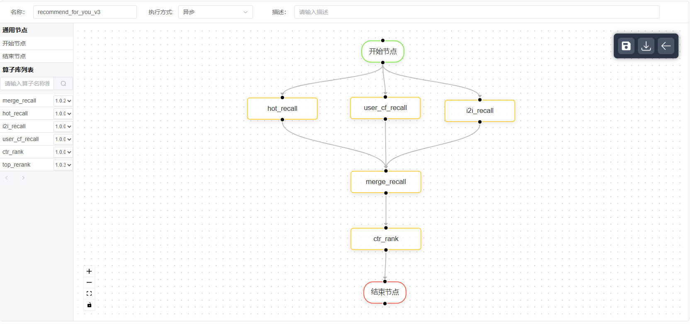

walle-flow 是一个轻量的业务编排框架

# 整体设计
策略开发平台为用户提供一套从算子开发，任务编排到策略上线的完整解决方案，实现了策略上线流程标准化平台化管理，沉淀策略通用能力。策略开发人员可以根据不同的业务场景对相应的业务流程进行编排和发布。相对于传统的策略开发上线流程，该方案具有以下优势：

- 流程组件化：将策略上线流程划分为三个阶段：算子开发，流程编排，任务运行；三阶段分别封装为完全解耦的三个组件，使方案整体具有高扩展性和低成本维护。
- 编排可视化：策略的编排采用标准的DAG模型，在页面直观的展现策略节点逻辑信息及节点间的逻辑关系，实现了策略逻辑完全透明。
- 逻辑算子化：框架提供一套统一的OP算子接口，实现了每个算子参数协议独立，功能单一，进一步减少策略代码的冗余度和提升代码的复用性。
